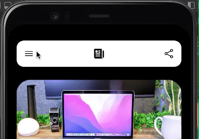

# Swith in React-Native

[](https://github.com/ravindra3003/react-native-toggle-switch)

[](https://github.com/ravindra3003/react-native-toggle-switch)

[](https://www.npmjs.com/package/switchin-react-native)
<!-- [](https://www.npmjs.com/package/switchin-react-native) -->

[](https://opensource.org/licenses/MIT)
[](https://github.com/prettier/prettier)

<p align="center">
  
</p>

# Installation

Add the dependency:

```ruby
npm i switchin-react-native
```

## Peer Dependencies

###### IMPORTANT! You need install them

<b><i>Zero Dependency</i></b>

# Usage

## Import

```js
import DuoToggleSwitch from "switchin-react-native";
```

## Basic Usage

```jsx
<DuoToggleSwitch
  primaryText="Map"
  secondaryText="List"
  onPrimaryPress={() => {}}
  onSecondaryPress={() => {}}
/>
```

OR (Also you can add icon like this)


```jsx
<DuoToggleSwitch
  primaryText={<Feather name="grid" size={24} color={'black'} />}
  secondaryText={<Feather name="menu" size={24} color={'black'} />}
  onPrimaryPress={() => {}}
  onSecondaryPress={() => {}}
/>
```

## Custom Usage

```jsx
<DuoToggleSwitch
  primaryText="Map"
  secondaryText="List"
  onPrimaryPress={() => {}}
  onSecondaryPress={() => {}}
  TouchableComponent={Ripple}
  rippleColor="#fff"
  rippleContainerBorderRadius={25}
/>
```

# Configuration - Props

TouchableComponent?: any;

| Property             |   Type    |     Default      | Description                                                         |
| -------------------- | :-------: | :--------------: | ------------------------------------------------------------------- |
| primaryText          |  string   |    undefined     | set the primary button's (left one) text                            |
| secondyText          |  string   |    undefined     | set the secondy button's (right one) text                           |
| activeColor          |  string   |     #FBA928      | change the button's background color when it is active or pressed   |
| inactiveColor        |  string   |       #fff       | change the button's background color when it is inactive or pressed |
| activeTextColor      |  string   |     #f1f1f1      | change the button's text color when it is active or pressed         |
| inactiveTextColor    |  string   |     #757575      | change the button's text color when it is active or pressed         |
| onPrimaryPress       | function  |       null       | set your own onPress logic for `first(primary) button`              |
| onSecondaryPress     | function  |       null       | set your own onPress logic for `second(secondary) button`           |
| style                | ViewStyle |     default      | set or override style for the `main container`                      |
| primaryButtonStyle   | ViewStyle |     default      | set or override style for the `primary button`                      |
| secondaryButtonStyle | ViewStyle |     default      | set or override style for the `secondary button`                    |
| primaryTextStyle     | TextView  |     default      | set or override style for `primary text style`                      |
| secondaryTextStyle   | TextView  |     default      | set or override style for `secondary text style`                    |
| TouchableComponent   | component | TouchableOpacity | set your own Pressable functionality instead of `TouchableOpacity`  |

## Author

Ravindra Nakrani, 0330.ravindra@gmail.com

## License

Switch in React-Native is available under the MIT license. See the LICENSE file for more info.
